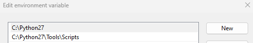
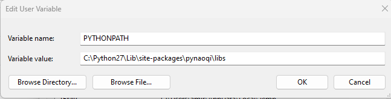

# nao_robots_sdk
Useful content to work with NAO V6 robots - Python SDK 


## Getting Started with the SDK


### Step 01: python 2.7 Installation. 

You should go to [here](https://www.python.org/downloads/release/python-270/) (official website of python) and download python 2.7. Then, you can simply install the executer and proceed with the given instruction.


Hints on Installation: 

1. Make sure that the version of python that you are installing is compatible with your OS. For instance, if you are using windows with the 64-bit version, make sure you install python 2.7 - 64 bits.
	
2. Install python for all users of your OS. 

3. Check the ``` add to my path ``` box in the installation instruction.

### Step 02: Add python 2.7 to your variable environment. 

* For Windows: 

In your search box, type ``` Edit environment variables for your account ``` and press enter.

Look for the "Path" in the ```User variables for "your user name"``` and double-click on it.

If python 2.7 already exists, adjust it to be on top of your list (like image 01)

Otherwise, if python 2.7 is not in the list, press "New" and add the two paths to have a setup like an image 01.

Image 01:



Finally, to make sure that you have installed python 2.7, you can run the idle and print("Hello World") 


* For Mac: 

To Be Defined

* For Linux: 

just drop [me](amirhossein.moallem2@unibo.it) a message, and we can do it together. 

### Step 03: Configuring the Naoqi - SDK 

You can find the packages and libraries of Nao in the following lists: 

Please download SDKs for your OS and unzip them. You can find it on Aldebaran official web page:

- [Official Web-page](https://www.aldebaran.com/fr/support/nao-6/downloads-softwares)

Or here:

- [Windows OS - 64](https://drive.google.com/drive/folders/10oGjYZyq_hBb_6_i7BMWUOhsODQLsKqu)

- [Mac OS](https://drive.google.com/drive/folders/1hOIRb9Ys9uM-thReRW-OHCo9aXzhQNBn)

After extracting, give them a proper name, let's say "pynaoqi" and copy them into the site-packages of your OS. 
If you did not change the setting during the python 2.7 installation, site-packages should be in the following directories: 


For Windows:

	-  C:\Python27\Lib\site-packages


For MAC: 

	- To Be Defined


Finally, you will need to add the python sdk to your python environment. To do so, open ``` Edit environment variables for your account ``` as you did in step 02. 

Similar to step 02, in the "User variables for "your user name" click on New and add the following path as shown in [image 02]: 




### Step 04: Hello World Test

Now you should be able to run your first python script with the Nao Robot. For that, you can navigate to examples and run the hello_world.py   

## Documentation 

Reading the documentation to learn how the firmware and the classes work is always helpful. The latest documents regarding our sdk can be found [here](http://doc.aldebaran.com/2-8/index_dev_guide.html) in Nao-SDK official webpage.


